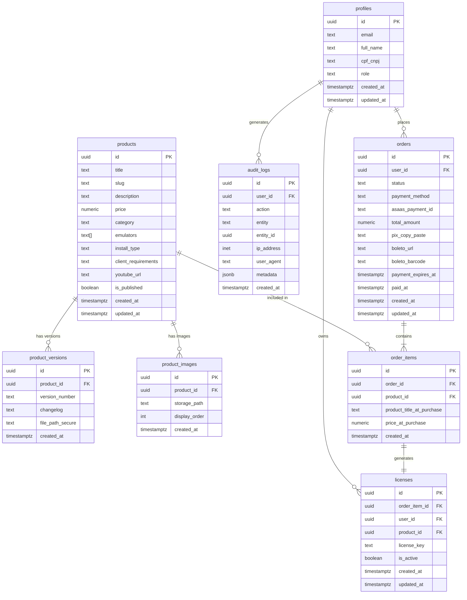

# Data Architecture: ro-store-v2
**Data:** 2026-02-18
**Referência:** [PRD](./ro-store-v2-prd.md) | [Architecture](./ro-store-v2-architecture.md) | [Security Review](./ro-store-v2-security-review.md)

---

## Diagrama de Entidades



---

## Tabelas

### `profiles`

Perfil do usuário — estende `auth.users` com dados de negócio.

```sql
CREATE TABLE profiles (
  id           UUID PRIMARY KEY REFERENCES auth.users(id) ON DELETE CASCADE,
  email        TEXT NOT NULL,
  full_name    TEXT,
  cpf_cnpj     TEXT,                                  -- fiscal: CPF (11 dígitos) ou CNPJ (14 dígitos), apenas números
  role         TEXT NOT NULL DEFAULT 'customer'
                 CHECK (role IN ('admin', 'customer')),
  created_at   TIMESTAMPTZ DEFAULT now() NOT NULL,
  updated_at   TIMESTAMPTZ DEFAULT now() NOT NULL
);

COMMENT ON COLUMN profiles.cpf_cnpj IS 'Dado fiscal sensível (LGPD). Apenas números, sem formatação. Nunca logar.';
COMMENT ON COLUMN profiles.role IS 'Roles fixos: admin (somente você) ou customer (compradores).';
```

---

### `products`

Produtos disponíveis para venda na loja.

```sql
CREATE TABLE products (
  id                   UUID PRIMARY KEY DEFAULT gen_random_uuid(),
  title                TEXT NOT NULL,
  slug                 TEXT NOT NULL UNIQUE,          -- URL-friendly: 'script-pvp-avancado'
  description          TEXT NOT NULL DEFAULT '',
  price                NUMERIC(10, 2) NOT NULL CHECK (price >= 0),
  category             TEXT NOT NULL
                         CHECK (category IN ('pvp', 'pve', 'quest', 'visual', 'economy', 'system')),
  emulators            TEXT[] NOT NULL DEFAULT '{}',  -- ['rathena', 'hercules']
  install_type         TEXT NOT NULL
                         CHECK (install_type IN ('script_npc', 'source_cpp', 'plugin_dll')),
  client_requirements  TEXT,                          -- ex: 'Data do Hexed 2021-11-03'
  youtube_url          TEXT,                          -- URL completa do YouTube (ex: https://youtu.be/abc)
  is_published         BOOLEAN NOT NULL DEFAULT false,
  created_at           TIMESTAMPTZ DEFAULT now() NOT NULL,
  updated_at           TIMESTAMPTZ DEFAULT now() NOT NULL
);

COMMENT ON COLUMN products.slug IS 'Gerado a partir do title no momento da criação. Imutável após publicação.';
COMMENT ON COLUMN products.emulators IS 'Array de emuladores suportados: rathena, hercules.';
```

> **Sem `file_path_secure` em `products`.** O arquivo fica em `product_versions`. A versão mais recente é determinada pela `product_versions` com maior `created_at` para aquele `product_id`.

---

### `product_versions`

Histórico de versões de cada produto. Cada versão tem seu próprio arquivo para download.

```sql
CREATE TABLE product_versions (
  id               UUID PRIMARY KEY DEFAULT gen_random_uuid(),
  product_id       UUID NOT NULL REFERENCES products(id) ON DELETE CASCADE,
  version_number   TEXT NOT NULL,                    -- ex: '1.0.0', '1.2.1'
  changelog        TEXT NOT NULL DEFAULT '',
  file_path_secure TEXT NOT NULL,                    -- caminho no bucket privado: 'products/{product_id}/{version}/{filename}'
  created_at       TIMESTAMPTZ DEFAULT now() NOT NULL,

  UNIQUE (product_id, version_number)                -- uma versão por número por produto
);

COMMENT ON COLUMN product_versions.file_path_secure IS 'RESTRITO: nunca incluir em SELECT retornado ao client. Usar apenas em download-service.ts com service_role.';
```

---

### `product_images`

Imagens da galeria de cada produto (Supabase Storage — bucket público).

```sql
CREATE TABLE product_images (
  id            UUID PRIMARY KEY DEFAULT gen_random_uuid(),
  product_id    UUID NOT NULL REFERENCES products(id) ON DELETE CASCADE,
  storage_path  TEXT NOT NULL,                       -- caminho no bucket público: 'product-media/{product_id}/{filename}'
  display_order INT NOT NULL DEFAULT 0,
  created_at    TIMESTAMPTZ DEFAULT now() NOT NULL
);
```

---

### `orders`

Pedidos de compra. Um pedido pode ter múltiplos items (preparado para expansão, mas MVP sempre tem 1).

```sql
CREATE TABLE orders (
  id                  UUID PRIMARY KEY DEFAULT gen_random_uuid(),
  user_id             UUID NOT NULL REFERENCES profiles(id) ON DELETE RESTRICT,
  status              TEXT NOT NULL DEFAULT 'pending_payment'
                        CHECK (status IN ('pending_payment', 'paid', 'expired', 'cancelled')),
  payment_method      TEXT NOT NULL
                        CHECK (payment_method IN ('pix', 'boleto', 'credit_card')),
  asaas_payment_id    TEXT UNIQUE,                   -- ID da cobrança no Asaas (para idempotência do webhook)
  total_amount        NUMERIC(10, 2) NOT NULL,        -- SNAPSHOT do valor total no momento do pedido
  -- Dados específicos do Pix (preenchidos pelo webhook de criação)
  pix_copy_paste      TEXT,
  -- Dados específicos do Boleto
  boleto_url          TEXT,
  boleto_barcode      TEXT,
  -- Expiração do método de pagamento
  payment_expires_at  TIMESTAMPTZ,
  -- Confirmação
  paid_at             TIMESTAMPTZ,
  created_at          TIMESTAMPTZ DEFAULT now() NOT NULL,
  updated_at          TIMESTAMPTZ DEFAULT now() NOT NULL
);

COMMENT ON COLUMN orders.total_amount IS 'SNAPSHOT: valor no momento do pedido. Nunca recalcular a partir do preço atual do produto.';
COMMENT ON COLUMN orders.asaas_payment_id IS 'Usado para idempotência: verificar antes de processar o webhook para evitar licenças duplicadas.';
COMMENT ON COLUMN orders.pix_copy_paste IS 'Dado temporário — expira junto com o Pix. Manter para referência do usuário na tela de aguardo.';
```

---

### `order_items`

Itens do pedido. Relaciona pedido ↔ produto com snapshot de preço e título.

```sql
CREATE TABLE order_items (
  id                      UUID PRIMARY KEY DEFAULT gen_random_uuid(),
  order_id                UUID NOT NULL REFERENCES orders(id) ON DELETE CASCADE,
  product_id              UUID NOT NULL REFERENCES products(id) ON DELETE RESTRICT,
  product_title_at_purchase TEXT NOT NULL,            -- SNAPSHOT do título no momento da compra
  price_at_purchase       NUMERIC(10, 2) NOT NULL,    -- SNAPSHOT do preço no momento da compra
  created_at              TIMESTAMPTZ DEFAULT now() NOT NULL,

  UNIQUE (order_id, product_id)                       -- impede comprar o mesmo produto duas vezes no mesmo pedido
);

COMMENT ON COLUMN order_items.product_title_at_purchase IS 'SNAPSHOT: título no momento da compra. Anti-chargeback: evidência do que foi vendido.';
COMMENT ON COLUMN order_items.price_at_purchase IS 'SNAPSHOT: preço cobrado. Nunca usar products.price retroativamente.';
```

---

### `licenses`

Licenças geradas após confirmação de pagamento. Uma licença por `order_item`.

```sql
CREATE TABLE licenses (
  id             UUID PRIMARY KEY DEFAULT gen_random_uuid(),
  order_item_id  UUID NOT NULL UNIQUE REFERENCES order_items(id) ON DELETE RESTRICT,
  user_id        UUID NOT NULL REFERENCES profiles(id) ON DELETE RESTRICT,
  product_id     UUID NOT NULL REFERENCES products(id) ON DELETE RESTRICT,
  license_key    TEXT NOT NULL UNIQUE,                -- ex: 'AB3F-9C2E-7D1A-FF20' (gerado pelo license-service.ts)
  is_active      BOOLEAN NOT NULL DEFAULT true,
  created_at     TIMESTAMPTZ DEFAULT now() NOT NULL,
  updated_at     TIMESTAMPTZ DEFAULT now() NOT NULL
);

COMMENT ON COLUMN licenses.license_key IS 'Hash único gerado pelo license-service.ts. Formato: XXXX-XXXX-XXXX-XXXX (uppercase alphanumeric).';
COMMENT ON COLUMN licenses.is_active IS 'FALSE quando revogada pelo admin. Impede geração de novas Signed URLs.';
```

---

### `audit_logs`

Registro imutável de ações críticas. Write-only — sem UPDATE ou DELETE para nenhum role.

```sql
CREATE TABLE audit_logs (
  id          UUID PRIMARY KEY DEFAULT gen_random_uuid(),
  user_id     UUID REFERENCES profiles(id) ON DELETE SET NULL,  -- NULL se usuário foi deletado
  action      TEXT NOT NULL,                           -- ver Ações Auditadas abaixo
  entity      TEXT NOT NULL,                           -- tabela afetada: 'orders', 'licenses', etc.
  entity_id   UUID,                                    -- ID do registro afetado
  ip_address  INET,                                    -- IP do cliente
  user_agent  TEXT,                                    -- User-Agent do browser
  metadata    JSONB DEFAULT '{}',                      -- dados extras específicos da ação
  created_at  TIMESTAMPTZ DEFAULT now() NOT NULL       -- sem updated_at — imutável
);

COMMENT ON TABLE audit_logs IS 'Imutável: sem UPDATE ou DELETE policies para nenhum role, incluindo admin.';
```

**Ações Auditadas (`action`):**

| Action | Quando | Metadata |
|--------|--------|----------|
| `customer_login` | Login de customer (email/senha ou Discord OAuth) | `{ provider: 'email' \| 'discord' }` |
| `order_created` | Criação de pedido (antes da confirmação de pagamento) | `{ order_id, payment_method, total_amount }` |
| `terms_accepted` | Checkout: checkbox anti-chargeback | `{ order_id, product_id, product_title }` |
| `order_paid` | Webhook: pagamento confirmado | `{ asaas_payment_id, payment_method, amount }` |
| `license_generated` | Após pagamento confirmado | `{ license_key_suffix: últimos 4 chars, product_id }` |
| `file_downloaded` | Download de arquivo | `{ product_id, version_number, license_id }` |
| `license_revoked` | Admin: revogação de licença | `{ reason: string \| null }` |
| `admin_login` | Login do admin | `{ provider: 'email' \| 'discord' }` |

> **Regra de segurança:** `metadata` nunca armazena `license_key` completa, `asaas_payment_id` completo ou qualquer dado sensível inteiro. Usar apenas sufixos (últimos 4 chars) ou hashes quando necessário para identificação.

---

## RLS Policies

### Visão Geral

| Tabela | SELECT | INSERT | UPDATE | DELETE |
|--------|--------|--------|--------|--------|
| `profiles` | Próprio + admin | Sistema (trigger) | Próprio (exceto role) + admin | Bloqueado |
| `products` | Públicos: todos; Rascunho: admin | Admin | Admin | Admin (soft delete via `is_published`) |
| `product_versions` | Autenticado (changelog) | Admin + service_role | Admin + service_role | Bloqueado |
| `product_images` | Todos (public) | Admin | Admin | Admin |
| `orders` | Próprio + admin | Autenticado (próprio) | service_role (webhook) | Bloqueado |
| `order_items` | Próprio (via order) + admin | service_role | service_role | Bloqueado |
| `licenses` | Próprio + admin | service_role | Admin + service_role | Bloqueado |
| `audit_logs` | Admin | service_role | Bloqueado | Bloqueado |

---

### SQL das Policies

```sql
-- =============================================
-- profiles
-- =============================================
ALTER TABLE profiles ENABLE ROW LEVEL SECURITY;

-- is_admin() usa SECURITY DEFINER — sem recursão ao verificar role do próprio usuário
CREATE POLICY profiles_select_own_or_admin ON profiles
  FOR SELECT USING (id = auth.uid() OR is_admin());

CREATE POLICY profiles_update_own ON profiles
  FOR UPDATE USING (id = auth.uid())
  WITH CHECK (
    id = auth.uid()
    AND NOT is_admin()  -- usuário comum não pode se tornar admin
  );

CREATE POLICY profiles_update_admin ON profiles
  FOR UPDATE USING (is_admin());

-- INSERT via trigger fn_handle_new_user (service_role) — sem policy de INSERT para usuários

-- =============================================
-- products
-- =============================================
ALTER TABLE products ENABLE ROW LEVEL SECURITY;

CREATE POLICY products_select_published ON products
  FOR SELECT USING (is_published = true OR is_admin());

CREATE POLICY products_insert_admin ON products
  FOR INSERT WITH CHECK (is_admin());

CREATE POLICY products_update_admin ON products
  FOR UPDATE USING (is_admin());

CREATE POLICY products_delete_admin ON products
  FOR DELETE USING (is_admin());

-- =============================================
-- product_versions
-- =============================================
ALTER TABLE product_versions ENABLE ROW LEVEL SECURITY;

-- Changelog visível para autenticados (produto publicado).
-- file_path_secure protegida por REVOKE SELECT no nível de coluna (ver abaixo).
CREATE POLICY product_versions_select_authenticated ON product_versions
  FOR SELECT USING (
    (auth.uid() IS NOT NULL AND EXISTS (
      SELECT 1 FROM products WHERE id = product_id AND is_published = true
    ))
    OR is_admin()
  );

CREATE POLICY product_versions_insert_admin ON product_versions
  FOR INSERT WITH CHECK (is_admin());

CREATE POLICY product_versions_update_admin ON product_versions
  FOR UPDATE USING (is_admin());

-- Sem DELETE policy — versões são imutáveis

-- =============================================
-- product_images
-- =============================================
ALTER TABLE product_images ENABLE ROW LEVEL SECURITY;

CREATE POLICY product_images_select_all ON product_images
  FOR SELECT USING (true);  -- imagens em bucket público

CREATE POLICY product_images_insert_admin ON product_images
  FOR INSERT WITH CHECK (is_admin());

CREATE POLICY product_images_update_admin ON product_images
  FOR UPDATE USING (is_admin());

CREATE POLICY product_images_delete_admin ON product_images
  FOR DELETE USING (is_admin());

-- =============================================
-- orders
-- =============================================
ALTER TABLE orders ENABLE ROW LEVEL SECURITY;

CREATE POLICY orders_select_own_or_admin ON orders
  FOR SELECT USING (user_id = auth.uid() OR is_admin());

CREATE POLICY orders_insert_authenticated ON orders
  FOR INSERT WITH CHECK (user_id = auth.uid());

-- UPDATE via service_role (webhook) — bypassa RLS automaticamente
-- Sem DELETE policy

-- =============================================
-- order_items
-- =============================================
ALTER TABLE order_items ENABLE ROW LEVEL SECURITY;

CREATE POLICY order_items_select_own_or_admin ON order_items
  FOR SELECT USING (
    EXISTS (
      SELECT 1 FROM orders
      WHERE orders.id = order_id AND orders.user_id = auth.uid()
    )
    OR is_admin()
  );

-- INSERT e UPDATE via service_role apenas — sem policy para usuário

-- =============================================
-- licenses
-- =============================================
ALTER TABLE licenses ENABLE ROW LEVEL SECURITY;

CREATE POLICY licenses_select_own_or_admin ON licenses
  FOR SELECT USING (user_id = auth.uid() OR is_admin());

-- INSERT e UPDATE via service_role (webhook + admin) — sem policy de INSERT para usuário
CREATE POLICY licenses_update_admin ON licenses
  FOR UPDATE USING (is_admin());

-- Sem DELETE policy

-- =============================================
-- audit_logs
-- =============================================
ALTER TABLE audit_logs ENABLE ROW LEVEL SECURITY;

CREATE POLICY audit_logs_select_admin ON audit_logs
  FOR SELECT USING (is_admin());

-- INSERT, UPDATE, DELETE apenas via service_role
-- Sem policies de INSERT/UPDATE/DELETE para usuários — imutável
```

---

## Supabase Storage — Políticas de Buckets

### Bucket: `product-media` (público)

```sql
-- Criar bucket público
INSERT INTO storage.buckets (id, name, public)
VALUES ('product-media', 'product-media', true);

-- Leitura pública
CREATE POLICY product_media_select_all ON storage.objects
  FOR SELECT USING (bucket_id = 'product-media');

-- Upload apenas admin
CREATE POLICY product_media_insert_admin ON storage.objects
  FOR INSERT WITH CHECK (bucket_id = 'product-media' AND is_admin());

CREATE POLICY product_media_update_admin ON storage.objects
  FOR UPDATE USING (bucket_id = 'product-media' AND is_admin());

CREATE POLICY product_media_delete_admin ON storage.objects
  FOR DELETE USING (bucket_id = 'product-media' AND is_admin());
```

### Bucket: `product-files` (privado)

```sql
-- Criar bucket privado
INSERT INTO storage.buckets (id, name, public)
VALUES ('product-files', 'product-files', false);

-- Sem política SELECT via RLS — acesso APENAS via Signed URL gerada com service_role
-- O download-service.ts usa createSignedUrl() com a service_role key — bypassa RLS

-- Upload apenas admin
CREATE POLICY product_files_insert_admin ON storage.objects
  FOR INSERT WITH CHECK (bucket_id = 'product-files' AND is_admin());
```

> **Importante:** o bucket `product-files` não tem política SELECT. O acesso a arquivos é **exclusivamente** via Signed URL gerada server-side com `SUPABASE_SERVICE_ROLE_KEY`. Nenhuma RLS policy de leitura para clientes.

### Column-Level Security — `file_path_secure`

RLS controla acesso a **linhas**, não a **colunas**. Sem proteção adicional, qualquer usuário autenticado poderia fazer `select('file_path_secure')` diretamente no Supabase. O `REVOKE SELECT` na coluna impede isso no nível do banco — independente da camada de aplicação.

```sql
-- Revogar acesso à coluna file_path_secure do role authenticated.
-- service_role (que bypassa RLS) ainda consegue ler — necessário para download-service.ts.
-- Incluir após todas as RLS policies, antes do Realtime.
REVOKE SELECT (file_path_secure) ON product_versions FROM authenticated;
```

---

## Triggers e Functions

### `fn_update_timestamp` — auto-atualiza `updated_at`

```sql
CREATE OR REPLACE FUNCTION fn_update_timestamp()
RETURNS TRIGGER LANGUAGE plpgsql AS $$
BEGIN
  NEW.updated_at = now();
  RETURN NEW;
END;
$$;

-- Aplicar em tabelas com updated_at
CREATE TRIGGER trg_profiles_updated_at
  BEFORE UPDATE ON profiles
  FOR EACH ROW EXECUTE FUNCTION fn_update_timestamp();

CREATE TRIGGER trg_products_updated_at
  BEFORE UPDATE ON products
  FOR EACH ROW EXECUTE FUNCTION fn_update_timestamp();

CREATE TRIGGER trg_orders_updated_at
  BEFORE UPDATE ON orders
  FOR EACH ROW EXECUTE FUNCTION fn_update_timestamp();

CREATE TRIGGER trg_licenses_updated_at
  BEFORE UPDATE ON licenses
  FOR EACH ROW EXECUTE FUNCTION fn_update_timestamp();
```

---

### `is_admin()` — helper para políticas RLS

Função auxiliar usada por **todas** as RLS policies que precisam verificar se o usuário autenticado é admin. Usa `SECURITY DEFINER` + `SET search_path = public` para evitar recursão infinita (policies em `profiles` que referenciam `profiles` causariam recursão se usassem subquery inline) e para prevenir search_path injection.

```sql
CREATE OR REPLACE FUNCTION is_admin()
RETURNS BOOLEAN
LANGUAGE plpgsql
STABLE
SECURITY DEFINER
SET search_path = public
AS $$
DECLARE
  _role TEXT;
BEGIN
  SELECT role INTO _role FROM profiles WHERE id = auth.uid();
  RETURN COALESCE(_role = 'admin', false);
END;
$$;
```

> **Por que SECURITY DEFINER?** Policies RLS em `profiles` que usam `EXISTS (SELECT 1 FROM profiles WHERE ...)` causam recursão infinita — o PostgreSQL aplica as RLS policies ao executar a subquery, que dispara a mesma policy, e assim por diante. `SECURITY DEFINER` faz a função executar com os privilégios do owner (postgres), bypassando RLS ao ler o role. `SET search_path = public` impede search_path injection.

---

### `fn_handle_new_user` — cria profile ao cadastrar

```sql
CREATE OR REPLACE FUNCTION fn_handle_new_user()
RETURNS TRIGGER LANGUAGE plpgsql
SECURITY DEFINER
SET search_path = public
AS $$
BEGIN
  INSERT INTO profiles (id, email, role)
  VALUES (NEW.id, NEW.email, 'customer')
  ON CONFLICT (id) DO NOTHING;
  RETURN NEW;
END;
$$;

CREATE TRIGGER trg_auth_users_after_insert
  AFTER INSERT ON auth.users
  FOR EACH ROW EXECUTE FUNCTION fn_handle_new_user();
```

> **SECURITY DEFINER** necessário porque `auth.users` é uma tabela do schema `auth` — o trigger precisa de permissão elevada para inserir em `profiles`. O `ON CONFLICT DO NOTHING` evita erro se o usuário já existir (ex: Discord OAuth re-registra).

---

### `fn_check_duplicate_license` — impede compra duplicada

```sql
CREATE OR REPLACE FUNCTION fn_check_duplicate_license()
RETURNS TRIGGER LANGUAGE plpgsql AS $$
BEGIN
  -- Impede criar order_item para produto que o usuário já tem licença ativa.
  -- Usa licenses.user_id diretamente — não precisa de JOIN via order_items.
  IF EXISTS (
    SELECT 1 FROM licenses
    WHERE product_id = NEW.product_id
      AND user_id = (SELECT user_id FROM orders WHERE id = NEW.order_id)
      AND is_active = true
  ) THEN
    RAISE EXCEPTION 'Usuário já possui licença ativa para este produto.';
  END IF;
  RETURN NEW;
END;
$$;

CREATE TRIGGER trg_order_items_before_insert
  BEFORE INSERT ON order_items
  FOR EACH ROW EXECUTE FUNCTION fn_check_duplicate_license();
```

> Defesa em profundidade: a Server Action também verifica isso antes de criar o pedido (ver Security Review). Esta trigger é a camada de banco — garante integridade mesmo se a validação da aplicação for bypassada.

---

## Índices

```sql
-- profiles
CREATE INDEX idx_profiles_role ON profiles(role);
-- Usado em: policies RLS (subquery EXISTS role = 'admin')

-- products
CREATE INDEX idx_products_is_published ON products(is_published);
-- Usado em: catálogo (WHERE is_published = true)

CREATE INDEX idx_products_category ON products(category);
-- Usado em: filtro do catálogo

CREATE INDEX idx_products_emulators ON products USING GIN(emulators);
-- Usado em: filtro por emulador (array contains query: emulators @> '{rathena}')

-- product_versions
CREATE INDEX idx_product_versions_product_id ON product_versions(product_id);
-- Usado em: buscar versões de um produto

CREATE INDEX idx_product_versions_product_created ON product_versions(product_id, created_at DESC);
-- Usado em: buscar versão mais recente (ORDER BY created_at DESC LIMIT 1)

-- product_images
CREATE INDEX idx_product_images_product_id ON product_images(product_id);

-- orders
CREATE INDEX idx_orders_user_id ON orders(user_id);
-- Usado em: "Meus Pedidos" (WHERE user_id = auth.uid())

CREATE INDEX idx_orders_asaas_payment_id ON orders(asaas_payment_id);
-- Usado em: idempotência do webhook (WHERE asaas_payment_id = ?)

CREATE INDEX idx_orders_status ON orders(status);
-- Usado em: filtros do admin

CREATE INDEX idx_orders_created_at ON orders(created_at DESC);
-- Usado em: ordenação da lista de pedidos

-- order_items
CREATE INDEX idx_order_items_order_id ON order_items(order_id);
CREATE INDEX idx_order_items_product_id ON order_items(product_id);

-- licenses
CREATE INDEX idx_licenses_user_id ON licenses(user_id);
-- Usado em: "Meus Pedidos" busca licenças do usuário

CREATE INDEX idx_licenses_product_id ON licenses(product_id);
-- Usado em: admin filtra licenças por produto + email de notificação de atualização

CREATE INDEX idx_licenses_is_active ON licenses(is_active);
-- Usado em: filtrar apenas licenças ativas

CREATE INDEX idx_licenses_order_item_id ON licenses(order_item_id);

-- audit_logs
CREATE INDEX idx_audit_logs_user_id ON audit_logs(user_id);
CREATE INDEX idx_audit_logs_action ON audit_logs(action);
CREATE INDEX idx_audit_logs_entity_id ON audit_logs(entity_id);
CREATE INDEX idx_audit_logs_created_at ON audit_logs(created_at DESC);
```

---

## Supabase Realtime

Habilitar Realtime na tabela `orders` para o hook `use-order-realtime.ts`:

```sql
-- Habilitar Realtime na tabela orders
ALTER PUBLICATION supabase_realtime ADD TABLE orders;
```

> Configurar também no Dashboard: **Database → Replication → Tables → orders → Enable**.

A RLS policy `orders_select_own_or_admin` garante que o cliente só recebe eventos de seus próprios pedidos.

---

## Seed Data

Nenhuma lookup table neste projeto. O único seed obrigatório é a criação do usuário admin:

### Admin User (manual, pós-deploy)

```sql
-- Após criar o usuário admin via Supabase Auth (email + senha):
-- Atualizar o role manualmente via Supabase Dashboard ou:
UPDATE profiles
SET role = 'admin'
WHERE email = 'seu-email@dominio.com';
```

> Registrar credenciais de acesso em `docs/credentials.md` (no `.gitignore` — nunca commitar).

---

## Queries Críticas

### Buscar versão mais recente de um produto (para download)

```sql
SELECT file_path_secure
FROM product_versions
WHERE product_id = $1
ORDER BY created_at DESC
LIMIT 1;
-- Executado com service_role key em download-service.ts
-- NUNCA expor file_path_secure ao client
```

### Verificar se usuário tem licença ativa para um produto

```sql
SELECT l.id, l.license_key, l.is_active
FROM licenses l
WHERE l.user_id = $1      -- auth.uid()
  AND l.product_id = $2
  AND l.is_active = true
LIMIT 1;
```

### Buscar clientes com licença ativa para notificação de atualização

```sql
SELECT DISTINCT p.email, p.full_name, l.license_key
FROM licenses l
JOIN profiles p ON p.id = l.user_id
WHERE l.product_id = $1
  AND l.is_active = true;
-- Executado com service_role em email-service.ts ao publicar nova versão
```

### Idempotência do webhook

```sql
SELECT id, status
FROM orders
WHERE asaas_payment_id = $1
LIMIT 1;
```

---

## Decisões

| Decisão | Alternativa descartada | Motivo |
|---------|----------------------|--------|
| `file_path_secure` em `product_versions` (não em `products`) | Coluna em `products` | Cada versão tem seu próprio arquivo. Manter histórico de arquivos por versão. |
| TEXT + CHECK para status e enums | PostgreSQL ENUM nativo | ENUM nativo é impossível de alterar sem migration destrutiva em produção |
| `product_title_at_purchase` como snapshot em `order_items` | JOIN com `products.title` | Título pode mudar. Anti-chargeback exige evidência do que foi vendido no momento da compra. |
| Licença gerada pelo webhook handler (app layer) | Trigger DB AFTER UPDATE | Geração envolve chamada ao Resend — lógica não pertence ao banco. Mais testável na camada da aplicação. |
| Sem tabela intermediária `order_payments` | Colunas Pix/Boleto em `orders` | MVP com um método por pedido — normalizar só quando houver necessidade real (YAGNI) |
| `SECURITY DEFINER` apenas em `fn_handle_new_user` e `is_admin()` | SECURITY DEFINER em mais functions | Superfície de segurança mínima — SECURITY DEFINER bypassa RLS, usar apenas quando absolutamente necessário |
| `is_admin()` SECURITY DEFINER para verificar role | Subquery inline `EXISTS (SELECT 1 FROM profiles ...)` nas policies | Subquery inline em policies da própria tabela `profiles` causa recursão infinita no PostgreSQL. Função SECURITY DEFINER bypassa RLS ao ler o role — resolve a recursão e centraliza a lógica. |
| `REVOKE SELECT (file_path_secure) FROM authenticated` | Depender apenas da camada de aplicação | RLS controla linhas, não colunas. Sem o REVOKE, qualquer autenticado pode selecionar `file_path_secure` diretamente. Defense in depth: proteger no banco, não só no código. |
| Supabase Realtime em `orders` | Polling a cada 3s | Realtime usa WebSocket (uma conexão) vs polling (N requests/usuário). Menor overhead. |

---

## Migration

### Arquivo: `supabase/migrations/20260218000000_initial_schema.sql`

O conteúdo desta migration é o conjunto de todos os `CREATE TABLE`, `CREATE INDEX`, `CREATE POLICY` e `CREATE TRIGGER` documentados acima, na seguinte ordem:

```
1. Extensions (uuid-ossp se necessário — gen_random_uuid() é nativo no PG14+)
2. fn_update_timestamp (function compartilhada pelos triggers)
3. is_admin() (helper SECURITY DEFINER — deve existir antes das RLS policies)
4. profiles (depende de auth.users)
5. fn_handle_new_user + trigger
6. products
7. product_versions
8. product_images
9. orders
10. order_items
11. fn_check_duplicate_license + trigger
12. licenses
13. audit_logs
14. Índices (todos)
15. RLS policies (todas as tabelas — usam is_admin())
16. REVOKE SELECT (file_path_secure) ON product_versions FROM authenticated
17. Storage buckets e policies (usam is_admin())
18. Supabase Realtime (ALTER PUBLICATION)
```

---

## Histórico de Versões

| Versão | Data | Mudança |
|--------|------|---------|
| 1.0 | 2026-02-18 | Versão inicial — schema completo do MVP |
| 1.1 | 2026-02-18 | Security Review Part 3: is_admin() SECURITY DEFINER, REVOKE SELECT file_path_secure, fn_handle_new_user SET search_path, fn_check_duplicate_license simplificado, catálogo audit_logs expandido |
